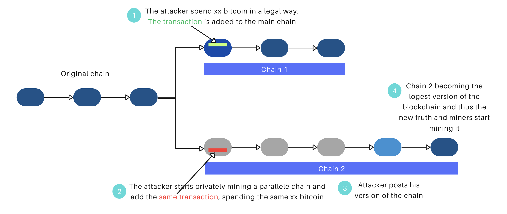
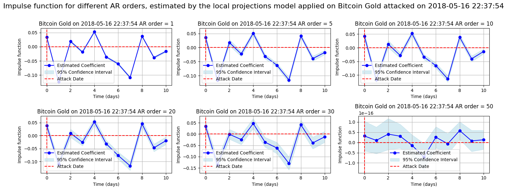

# Impact_of_forking_attacks

## Introduction

This study examines the vulnerabilities of blockchain technology, particularly in relation to 51% attacks, where an entity gains majority control over the network's mining power, compromising security and disrupting market confidence. These attacks not only threaten the integrity of the blockchain but also enable malicious activities such as double spending, where an attacker can spend the same cryptocurrency multiple times.

The central hypothesis suggests that a successful 51% attack leads to a decrease in the attacked cryptocurrency's price. This decline creates an opportunity for the attacker to acquire additional coins at a lower cost during the subsequent market recovery, suggesting that the attacker's motivations extend beyond immediate financial gains to encompass long-term strategic advantages.

Furthermore, the second hypothesis explores the impact of multiple attacks on a single cryptocurrency. It asserts that the effects of a subsequent attack are more severe, reflecting a lack of network resilience. This pattern of vulnerability is particularly concerning, as it signals that repeated attacks can lead to sharper declines in returns and an increased risk of potential delisting.

To verify these hypotheses, this paper will reproduce existing literature on the impact of 51% attacks measured through abnormal returns, confirming previous findings of significant short-term economic repercussions. Moreover, for robustness, we will employ a new methodology recently utilized in other cryptocurrency incidents but not yet applied to 51% attacks. Specifically, the contribution will incorporate local projections as a second model to analyze the dynamics of market reactions to these attacks. By adopting this innovative approach, the study aims not only to measure the impact of these attacks in a more robust manner but also to introduce a novel way of analyzing their effects on the cryptocurrency market.

  
  
<em>Figure 1: A diagram illustrating blockchain forks caused by 51% attacks.</em>

## Literature Review

In the literature review, we explored several key elements relevant to our study:

- **Blockchain Vulnerabilities:** Smaller networks are particularly at risk for 51% attacks due to their lower computational requirements (Saad et al., 2019).
- **Motivations for Attacks:** Attacks can be self-interested, seeking financial gain, or selfless, aimed at broader disruption (Kroll et al., 2013).
- **Economic Impact:** Research shows that 51% attacks typically lead to price declines of 12% to 15%, raising concerns about the sustainability of permissionless blockchain security (Savva Shanaev et al., 2018). Gans and Halaburda (2023) introduce the concept of negative-cost attacks.
- **Methodological Approaches:** The review highlights the use of local projections, which effectively capture the lasting impacts of shocks on cryptocurrency valuations (Ester Faia et al., 2019).

## Cryptocurrency Individual Series and Market Characteristics

This study investigates cryptocurrency returns to assess market vulnerabilities, especially concerning 51% attacks. We compare logarithmic returns and discrete returns to determine which metric better captures cryptocurrency price movements.

Our preliminary statistical comparisons reveal that discrete returns exhibit higher mean and variance, indicating greater price movements during significant events. This is crucial for quantifying the economic implications of 51% attacks.

Volatility analysis, measured by standard deviation, further informs our understanding of market stability in response to attacks. Given the continuous nature of cryptocurrency trading, we prefer logarithmic returns to ensure a robust evaluation of the economic impact of 51% attacks.

Descriptive statistics for daily returns indicate significant deviations from normality, characterized by positive skewness and excess kurtosis, with extreme returns influenced by market manipulation and sudden exchange changes. The market index shows a mean return of approximately -0.000102, highlighting skewness due to extreme values. The standard deviation is around 0.006332, reflecting substantial volatility, while the minimum and maximum returns are approximately -0.050786 and 0.048341, respectively, indicating a wide range of price movements.

## Event Study Methodology Using Abnormal Returns

The Event Study Methodology is employed to evaluate the impact of specific events, such as 51% attacks, on cryptocurrency returns. By comparing actual returns to expected returns, we utilize Cumulative Abnormal Return (CAR) as a key metric. A positive CAR indicates outperformance, while a negative CAR signifies underperformance.

In our study, we employ the Market Model (MM) to analyze the impact of 51% attacks on cryptocurrency returns. The Market Model is defined as:

$$E(R_{i,t}) = \alpha_i + \beta_i R_{m,t}$$

This model estimates expected returns based on overall market movements, enabling the calculation of abnormal returns (AR):

$$AR_{i,t} = R_{i,t} - E(R_{i,t})$$

The decision to favor the Market Model stems from its robustness against data skewness. This makes the MM particularly effective in providing unbiased estimates of expected returns.

Given the extreme returns prevalent in cryptocurrency markets, we chose the Robust Linear Model (RLM) using Huber Regression for our analysis.

To benchmark our analysis, we use the Crescent Crypto Market Index (CCMIX), which tracks major digital assets with weights based on market capitalization, smoothed using a 90-day trailing average.

We define an event window that captures the immediate aftermath of an attack, alongside an estimation window spanning 80 days. This duration is justified by the high volatility inherent in cryptocurrency markets, consistent with findings from previous studies.

To evaluate the significance of abnormal returns resulting from 51% attacks, we employ non-parametric significance tests such as GRANK-T and G-SIGN statistics. These tests are well-suited for the non-normal distribution of cryptocurrency returns, allowing for a robust analysis of attack impacts while accounting for the market's unique volatility. This rigorous methodology underpins our exploration of the economic implications of 51% attacks.

## Local Projections: A Flexible Approach to Analyzing Market Reactions

The Local Projections (LP) method provides a dynamic alternative to the Abnormal Returns (AR) model.

Our model estimates the impact of events like 51% attacks on asset returns across multiple future time horizons using the following Long-Difference specification:

$$\Delta y_{t+h} = \alpha_h + \beta_h D_t + \gamma_h X_t + \epsilon_{t+h}$$

where $$\Delta y_{t+h}$$ represents the change in returns at horizon $$h$$, $$D_t$$ is the event indicator, and $$X_t$$ includes control variables. The use of the Long-Difference specification is particularly advantageous because it minimizes finite-sample bias.

To handle data challenges like heteroskedasticity and autocorrelation, we adopt the Newey-West estimator, which corrects standard errors and enhances statistical validity.

  
  
<em>Figure 2: Local projections of the 51% attack on BTG for different AR orders.</em>

## Results and Discussion

### Reproducing Literature Findings on the Impact of 51% Attacks

Our analysis aligns with prior research by Shanaev and Ramos regarding the impact of 51% attacks on cryptocurrency returns. Consistent with the findings of these studies, we observe that most attacks lead to a negative effect on market performance, as evidenced by significant negative cumulative abnormal returns (CAAR). For instance, the 2018 Bitcoin Gold attack resulted in an abnormal return of -18.07% on the day of the attack, with adverse effects persisting for up to ten days afterward.

Conversely, some attacks, like the 2020 Bitcoin Gold incident, exhibited no significant impact on returns, suggesting that certain cryptocurrencies may be better positioned to absorb the shock.

### Local Projections and Clustering Results

The application of Local Projections (LP) analysis revealed clusters of responses consistent with cumulative abnormal return (CAR) findings, thereby enhancing the reliability of our results. We identified five distinct clusters, each illustrating different responses to 51% attacks:

- **Low Response:** Limited effect, indicating resilience (e.g., Ethereum Classic).
- **Moderate Response:** Mixed reactions, with some recovery (e.g., Bitcoin Gold).
- **Negative Response:** Persistent declines, confirming vulnerability (e.g., Bitcoin Gold’s 2018 attack).
- **High Positive Response:** Rebounds following initial declines (e.g., MonaCoin).
- **Significant Negative Response:** Severe declines, validating our hypothesis (e.g., Public Index Network, Firo).

### Impact of Subsequent Attacks

Our findings suggest that the impact of multiple attacks varies significantly among cryptocurrencies. While Bitcoin Gold demonstrated some recovery after repeated attacks, others like MonaCoin and Verge experienced a steady decline in investor trust. This divergence indicates that market resilience is not uniform across all cryptocurrencies.

## Conclusion Relative to Initial Hypotheses and Objectives

This study effectively addresses our initial hypotheses concerning the impact of 51% attacks on cryptocurrency returns. The results confirm that these attacks generally lead to significant negative CARs in most cases, validating our hypothesis that security breaches undermine market confidence and price stability. Furthermore, the analysis of subsequent attacks highlights that the effects of repeated vulnerabilities are often more severe.

The application of local projections in our study not only validated the results obtained from the CAR analysis but also demonstrated the robustness of our findings regarding market reactions to 51% attacks.

In light of these results, we suggest further research avenues that could include behavioral analyses of miners and attackers and the evaluation of mitigation strategies.
